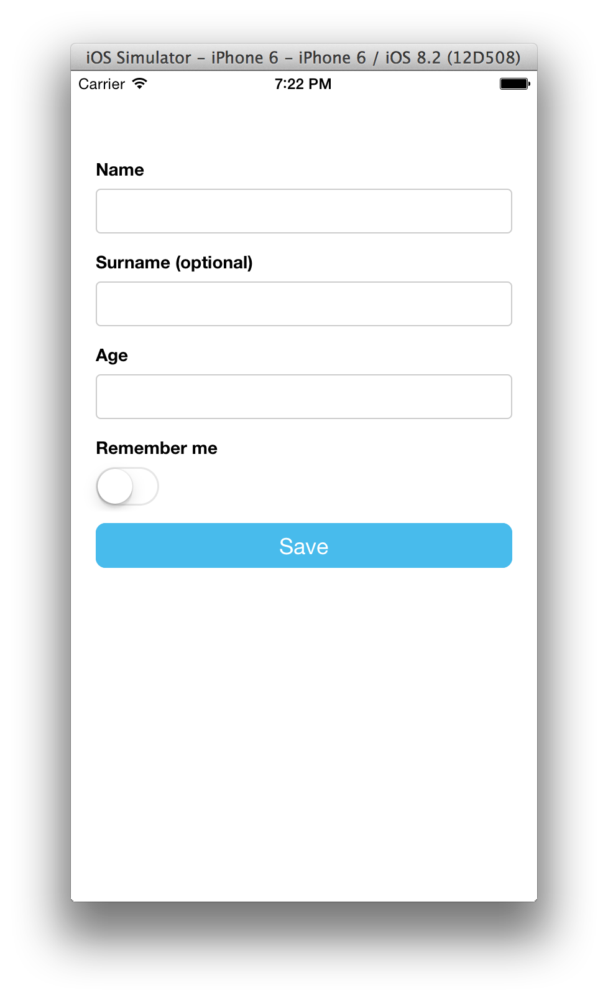

# Setup

```
npm install tcomb-form-native
```

# Domain Driven Forms

The [tcomb library](https://github.com/gcanti/tcomb) provides a concise but expressive way to define domain models in JavaScript.

The [tcomb-validation library](https://github.com/gcanti/tcomb-validation) builds on tcomb, providing validation functions for tcomb domain models.

This library builds on those two and the awesome react-native.

# Benefits

With tcomb-form-native you simply call `<Form type={Model} />` to generate a form based on that domain model. What does this get you?

1. Write a lot less code
2. Usability and accessibility for free (automatic labels, inline validation, etc)
3. No need to update forms when domain model changes


# Example

```js
// index.ios.js

var React = require('react-native');
var t = require('tcomb-form-native');

var Person = t.struct({
  name: t.Str,              // a required string
  surname: t.maybe(t.Str),  // a optional string
  age: t.Num,               // a required number
  rememberMe: t.Bool        // a boolean
});

var options = {}; // optional rendering options...

var AwesomeProject = React.createClass({

  onPress: function () {
    var value = this.refs.form.getValue();
    if (value) {
      console.log(value);
    }
  },

  render: function() {
    return (
      <View>
        <t.form.Form
          ref="form"
          type={Person}
          options={options}
        />
        <TouchableHighlight onPress={this.onPress}>
          <Text>Save</Text>
        </TouchableHighlight>
      </View>
    );
  }
});
```

### Result:



### Preview after a validation error:


# Docs and API

Coming soon...

# License

MIT
