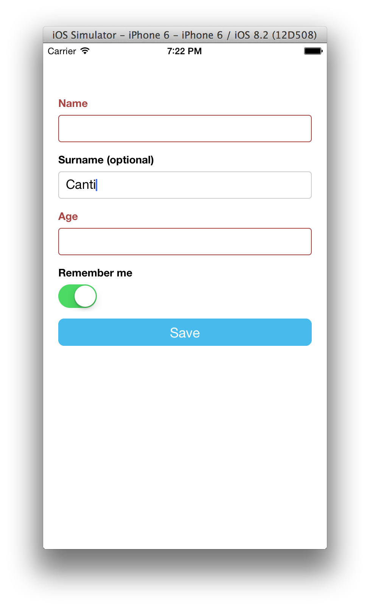
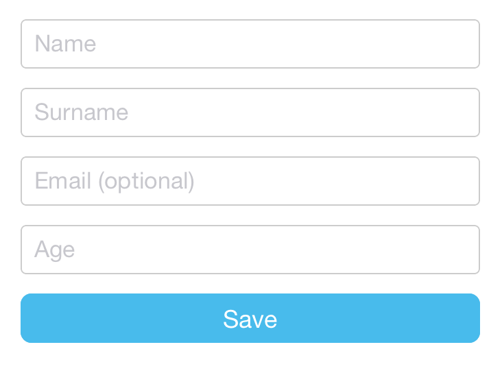
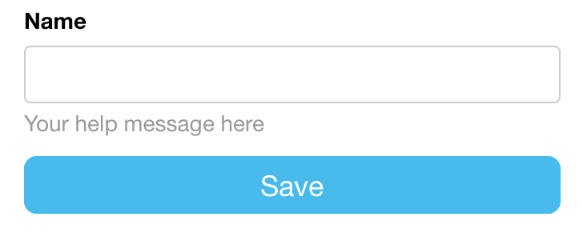
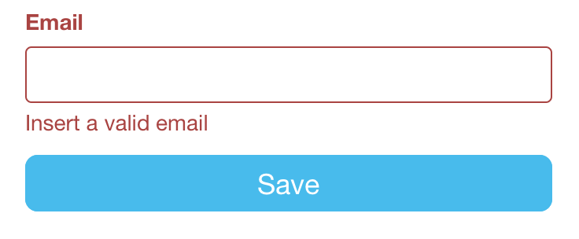

# Setup

```
npm install tcomb-form-native
```

### Domain Driven Forms

The [tcomb library](https://github.com/gcanti/tcomb) provides a concise but expressive way to define domain models in JavaScript.

The [tcomb-validation library](https://github.com/gcanti/tcomb-validation) builds on tcomb, providing validation functions for tcomb domain models.

This library builds on those two and the awesome react-native.

### Benefits

With **tcomb-form-native** you simply call `<Form type={Model} />` to generate a form based on that domain model. What does this get you?

1. Write a lot less code
2. Usability and accessibility for free (automatic labels, inline validation, etc)
3. No need to update forms when domain model changes

### JSON Schema support

JSON Schemas are also supported via the (tiny) [tcomb-json-schema library](https://github.com/gcanti/tcomb-json-schema).

### Pluggable look and feel

The look and feel is customizable via react-native stylesheets and *templates* (see documentation).

# Example

```js
// index.ios.js

'use strict';

var React = require('react-native');
var t = require('tcomb-form-native');
var { AppRegistry, StyleSheet, Text, View, TouchableHighlight } = React;

var Form = t.form.Form;

// here we are: define your domain model
var Person = t.struct({
  name: t.Str,              // a required string
  surname: t.maybe(t.Str),  // an optional string
  age: t.Num,               // a required number
  rememberMe: t.Bool        // a boolean
});

var options = {}; // optional rendering options (see documentation)

var AwesomeProject = React.createClass({

  onPress: function () {
    // call getValue() to get the values of the form
    var value = this.refs.form.getValue();
    if (value) { // if validation fails, value will be null
      console.log(value); // value here is an instance of Person
    }
  },

  render: function() {
    return (
      <View style={styles.container}>
        {/* display */}
        <Form
          ref="form"
          type={Person}
          options={options}
        />
        <TouchableHighlight style={styles.button} onPress={this.onPress} underlayColor='#99d9f4'>
          <Text style={styles.buttonText}>Save</Text>
        </TouchableHighlight>
      </View>
    );
  }
});

var styles = StyleSheet.create({
  container: {
    justifyContent: 'center',
    marginTop: 50,
    padding: 20,
    backgroundColor: '#ffffff',
  },
  title: {
    fontSize: 30,
    alignSelf: 'center',
    marginBottom: 30
  },
  buttonText: {
    fontSize: 18,
    color: 'white',
    alignSelf: 'center'
  },
  button: {
    height: 36,
    backgroundColor: '#48BBEC',
    borderColor: '#48BBEC',
    borderWidth: 1,
    borderRadius: 8,
    marginBottom: 10,
    alignSelf: 'stretch',
    justifyContent: 'center'
  }
});

AppRegistry.registerComponent('AwesomeProject', () => AwesomeProject);
```

**Output:**

(Labels are automatically generated)


**Ouput after a validation error:**



# Types

### Required field

By default fields are required:

```js
var Person = t.struct({
  name: t.Str,    // a required string
  surname: t.Str  // a required string
});
```

### Optional field

In order to create an optional field, wrap the field type with the `t.maybe` combinator:

```js
var Person = t.struct({
  name: t.Str,
  surname: t.Str,
  email: t.maybe(t.Str) // an optional string
});
```

The postfix `" (optional)"` is automatically added to optional fields.

### Numbers

In order to create a numeric field, use the `t.Num` type:

```js
var Person = t.struct({
  name: t.Str,
  surname: t.Str,
  email: t.maybe(t.Str),
  age: t.Num // a numeric field
});
```

tcomb-form-native will convert automatically numbers to / from strings.

### Booleans

In order to create a boolean field, use the `t.Bool` type:

```js
var Person = t.struct({
  name: t.Str,
  surname: t.Str,
  email: t.maybe(t.Str),
  age: t.Num,
  rememberMe: t.Bool // a boolean field
});
```

Booleans are displayed as `SwitchIOS`s.

### Enums

In order to create an enum field, use the `t.enums` combinator:

```js
var Gender = t.enums({
  M: 'Male',
  F: 'Female'
});

var Person = t.struct({
  name: t.Str,
  surname: t.Str,
  email: t.maybe(t.Str),
  age: t.Num,
  rememberMe: t.Bool,
  gender: Gender // enum
});
```

Enums are displayed as `PickerIOS`s.

### Subtypes

A *predicate* is a function with the following signature:

```
(x: any) => boolean
```

You can refine a type with the `t.subtype(type, predicate)` combinator:

```js
// a type representing positive numbers
var Positive = t.subtype(t.Num, function (n) {
  return n >= 0;
});

var Person = t.struct({
  name: t.Str,
  surname: t.Str,
  email: t.maybe(t.Str),
  age: Positive, // refinement
  rememberMe: t.Bool,
  gender: Gender
});
```

Subtypes allow you to express any custom validation with a simple predicate.

# Rendering options

In order to customize the look and feel, use an `options` prop:

```js
<Form type={Model} options={options} />
```

## Form component

### Labels

By default labels are automatically generated. You can turn off this behaviour or override the default labels
on field basis.

### Placeholders

In order to automatically generate default placeholders, use the option `auto: 'placeholders'`:

```js
var options = {
  auto: 'placeholders'
};

<Form type={Person} options={options} />
```



Set `auto: 'none'` if you don't want neither labels nor placeholders.

```js
var options = {
  auto: 'none'
};
```

### Fields order

You can sort the fields with the `order` option:

```js
var options = {
  order: ['name', 'surname', 'rememberMe', 'gender', 'age', 'email']
};
```

### Default values

You can set the default values passing a `value` prop to the `Form` component:

```js
var value = {
  name: 'Giulio',
  surname: 'Canti',
  age: 41,
  gender: 'M'
};

<Form type={Model} value={value} />
```

### Fields configuration

You can configure each field with the `fields` option:

```js
var options = {
  fields: {
    name: {
      // name field configuration here..
    },
    surname: {
      // surname field configuration here..
    }
  }
});
```

## Textbox component

**Tech note.** Values containing only white spaces are converted to `null`.

### Placeholders

You can set the placeholder with the `placeholder` option:

```js
var options = {
  fields: {
    name: {
      placeholder: 'Your placeholder here'
    }
  }
};
```

### Labels

You can set the label with the `label` option:

```js
var options = {
  fields: {
    name: {
      label: 'Insert your name'
    }
  }
};
```

### Help messages

You can set a help message with the `help` option:

```js
var options = {
  fields: {
    name: {
      help: 'Your help message here'
    }
  }
};
```



### Error messages

You can set a custom error message with the `error` option:

```js
var options = {
  fields: {
    email: {
      error: 'Insert a valid email'
    }
  }
};
```



tcomb-form-native will show the error message when the field validation fails.
You can also use a function with the following signature:

```js
(value: any) => string
```

where the `value` param contains the current field value. The value returned by the function will be used as message.

### Other standard options

The following standard options are available (see http://facebook.github.io/react-native/docs/textinput.html):

- `autoCapitalize`
- `autoCorrect`
- `autoFocus`
- `bufferDelay`
- `clearButtonMode`
- `editable`
- `keyboardType`
- `multiline`
- `onBlur`
- `onEndEditing`
- `onFocus`
- `onSubmitEditing`
- `placeholderTextColor`
- `selectionState`

## Checkbox component

Coming soon.

## Select component

Coming soon.

## DatePicker component

Coming soon.

# Customization

## Stylesheets

Coming soon.

## Custom templates

Coming soon.

## Custom components

Coming soon.

# License

MIT
