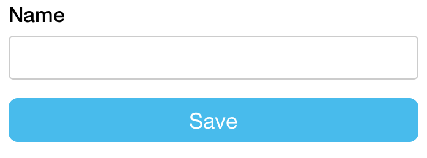
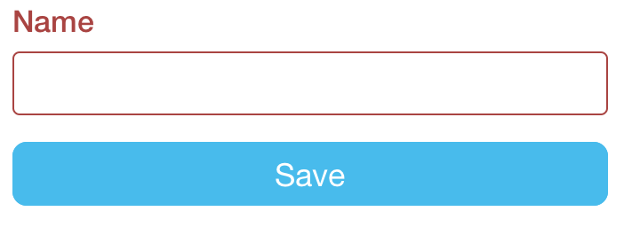
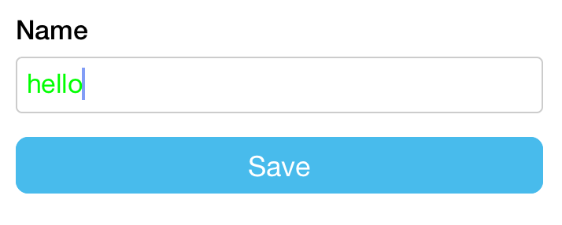
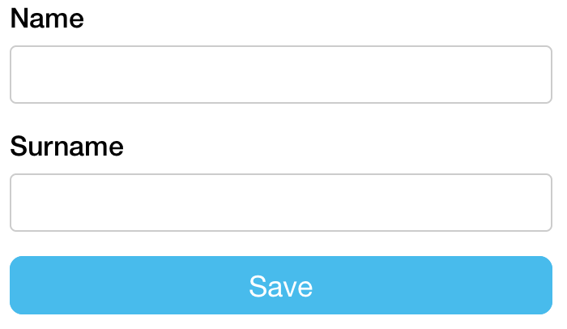
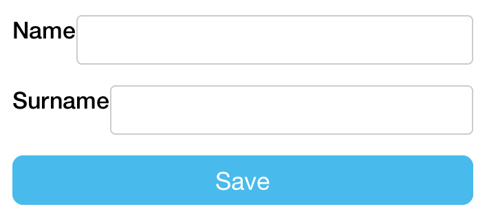
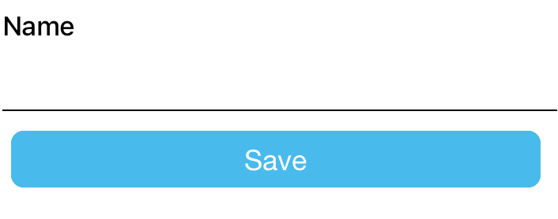

# Stylesheets

There are several levels of customization in `tcomb-form-native`:

- stylesheets
- templates
- factories

Let's focus on the first one: stylesheets.

## Basics and tech details

Let's define a simple type useful in the following examples:

```js
const Type = t.struct({
  name: t.String
});
```

By default `tcomb-form-native` will display a textbox styled with a boostrap-like look and feel. The default stylesheet is defined [here](https://github.com/gcanti/tcomb-form-native/blob/master/lib/stylesheets/bootstrap.js).

This is the normal look and feel of a textbox (border: gray)



and this is the look and feel when an error occurs (border: red)



The style management is coded in the `lib/stylesheets/bootstrap` module, specifically by the following lines:

```js
textbox: {

  // the style applied wihtout errors
  normal: {
    color: '#000000',
    fontSize: 17,
    height: 36,
    padding: 7,
    borderRadius: 4,
    borderColor: '#cccccc', // <= relevant style here
    borderWidth: 1,
    marginBottom: 5
  },

  // the style applied when a validation error occours
  error: {
    color: '#000000',
    fontSize: 17,
    height: 36,
    padding: 7,
    borderRadius: 4,
    borderColor: '#a94442', // <= relevant style here
    borderWidth: 1,
    marginBottom: 5
  }

}
```

Depending on the state of the textbox, `tcomb-form-native` passes in the proper style to the `<TextInput />` RN component (code [here](https://github.com/gcanti/tcomb-form-native/blob/master/lib/templates/bootstrap/textbox.js)).

You can override the default stylesheet both locally and globally.

## Overriding the style locally

Say you want the text entered in a texbox being green:

```js
var t = require('tcomb-form-native');
var _ = require('lodash');

// clone the default stylesheet
const stylesheet = _.cloneDeep(t.form.Form.stylesheet);

// overriding the text color
stylesheet.textbox.normal.color = '#00FF00';

const options = {
  fields: {
    name: {
      stylesheet: stylesheet // overriding the style of the textbox
    }
  }
};

...

// other forms in you app won't be affected
<t.form.Form type={Type} options={options} />
```

**Output**



**Note**. This is the list of styles that you can override:

- textbox
  - normal
  - error
  - notEditable
- checkbox
  - normal
  - error
- select
  - normal
  - error
- datepicker
  - normal
  - error
- formGroup
- controlLabel
- helpBlock
- errorBlock
- textboxView

## Overriding the style globally

Just omit the `deepclone` call, the style will be applied to all textboxes

```js
var t = require('tcomb-form-native');

// overriding the text color for every textbox in every form of your app
t.form.Form.stylesheet.textbox.normal.color = '#00FF00';
```

## Examples

### Horizontal forms

Let's add a `surname` field:

```js
const Type = t.struct({
  name: t.String,
  surname: t.String
});
```

The default layout is vertical:



I'll use flexbox in order to display the textboxes horizontally:

```js
var _ = require('lodash');

const stylesheet = _.cloneDeep(t.form.Form.stylesheet);

stylesheet.fieldset = {
  flexDirection: 'row'
};
stylesheet.formGroup.normal.flex = 1;
stylesheet.formGroup.error.flex = 1;

const options = {
  stylesheet: stylesheet
};
```

**Output**


### Label on the left side

```js
var _ = require('lodash');

const stylesheet = _.cloneDeep(t.form.Form.stylesheet);

stylesheet.formGroup.normal.flexDirection = 'row';
stylesheet.formGroup.error.flexDirection = 'row';
stylesheet.textbox.normal.flex = 1;
stylesheet.textbox.error.flex = 1;

const options = {
  stylesheet: stylesheet
};
```

**Output**




### Material Design Style Underlines

```js
var _ = require('lodash');

const stylesheet = _.cloneDeep(t.form.Form.stylesheet);

stylesheet.textbox.normal.borderWidth = 0;
stylesheet.textbox.error.borderWidth = 0;
stylesheet.textbox.normal.marginBottom = 0;
stylesheet.textbox.error.marginBottom = 0;

stylesheet.textboxView.normal.borderWidth = 0;
stylesheet.textboxView.error.borderWidth = 0;
stylesheet.textboxView.normal.borderRadius = 0;
stylesheet.textboxView.error.borderRadius = 0;
stylesheet.textboxView.normal.borderBottomWidth = 1;
stylesheet.textboxView.error.borderBottomWidth = 1;
stylesheet.textbox.normal.marginBottom = 5;
stylesheet.textbox.error.marginBottom = 5;

const options = {
  stylesheet: stylesheet
};
```

**Output**



